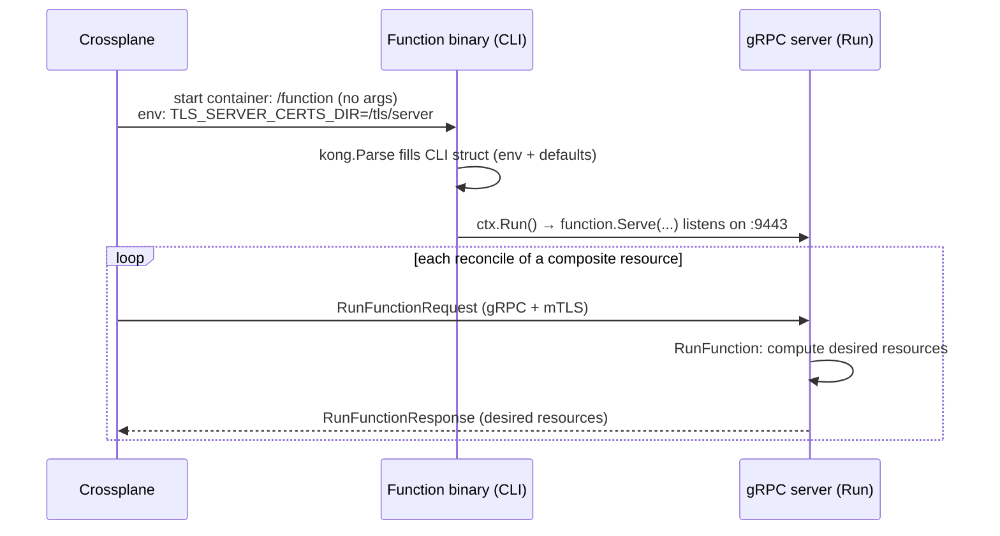

# CLI in Go apps

## What "CLI" means

In Go, the **CLI** is the layer of a program that:

1. Parses arguments, flags, and environment variables passed when the binary is launched
   (e.g. `./function --debug --address=:9443`).
2. Maps those inputs into typed configuration values.
3. Starts whatever the program actually does.

The `main()` function is the entry point of any Go executable. The "CLI" is simply the structured
way of turning `os.Args` and environment variables into configuration and then handing control to
the program's real logic.

This is a **completely generic concept**; not specific to Crossplane, gRPC, or any framework.
Essentially every standalone Go binary has some form of it.

## The common pattern

Modern Go CLIs follow what is often called the **command object pattern**:

- Define a struct whose fields *are* the configuration.
- Use struct tags to describe *defaults*, *help* text, environment bindings, and *short* flags.
- Attach a `Run()` method that contains the "execute" behavior.
- Let a parser bind input → struct, then invoke `Run()`.

This is more declarative and maintainable than a long list of imperative `flag.StringVar(...)`
calls.

### Example (from this repo)

```go
// CLI of this Function.
type CLI struct {
    Debug bool `help:"Emit debug logs in addition to info logs." short:"d"`

    Network     string `default:"tcp"   help:"Network on which to listen for gRPC connections."`
    Address     string `default:":9443" help:"Address at which to listen for gRPC connections."`
    TLSCertsDir string `env:"TLS_SERVER_CERTS_DIR" help:"Directory containing server certs."`
    Insecure    bool   `help:"Run without mTLS credentials."`
    MaxRecvMessageSize int `default:"4" help:"Maximum size of received messages in MB."`
}

// Run this Function.
func (c *CLI) Run() error {
    // ... start the program using the parsed configuration ...
}

func main() {
    ctx := kong.Parse(&CLI{}, kong.Description("A Crossplane Composition Function."))
    ctx.FatalIfErrorf(ctx.Run())
}
```

The struct tags (`help`, `default`, `env`, `short`) are read by a CLI-parsing library. Here that
library is [kong](https://github.com/alecthomas/kong). `kong.Parse(&CLI{})` fills the struct from
the command line and environment, and `ctx.Run()` invokes the `Run()` method.

## Common parsing libraries

The mechanism is generic; only the library choice varies:

| Library | Notes |
| --- | --- |
| `flag` (stdlib) | Built in, imperative, minimal. |
| [`kong`](https://github.com/alecthomas/kong) | Declarative struct tags + command objects. Used here. |
| [`cobra`](https://github.com/spf13/cobra) | Widely used, subcommand-heavy (kubectl, Helm). |
| [`urfave/cli`](https://github.com/urfave/cli) | Popular, flexible flag/command model. |

All of them serve the same role: turn command-line input into configuration and dispatch to code.

## Without vs. with a CLI library

The same program can be written by hand or with a CLI library. Both produce the exact same
behavior; the difference is how much boilerplate you maintain.

### Without a CLI

You declare each flag imperatively, wire in environment variables yourself, apply defaults,
compose the help text, and handle errors and exit codes manually.

> `flag` is Go's standard-library package for command-line flag parsing; [pkg.go.dev/flag](https://pkg.go.dev/flag) ships with Go itself.

```go
package main

import (
    "flag"
    "fmt"
    "os"
)

func main() {
    // 1. Declare every flag by hand.
    debug := flag.Bool("debug", false, "Emit debug logs in addition to info logs.")
    network := flag.String("network", "tcp", "Network on which to listen for gRPC connections.")
    address := flag.String("address", ":9443", "Address at which to listen for gRPC connections.")
    tlsCertsDir := flag.String("tls-server-certs-dir", "", "Directory containing server certs.")
    insecure := flag.Bool("insecure", false, "Run without mTLS credentials.")
    maxRecv := flag.Int("max-recv-message-size", 4, "Maximum size of received messages in MB.")

    // 2. `-d` shorthand must be registered separately.
    flag.BoolVar(debug, "d", false, "Emit debug logs (shorthand).")

    flag.Parse()

    // 3. Environment-variable binding is not built in; do it yourself.
    if v := os.Getenv("TLS_SERVER_CERTS_DIR"); v != "" && *tlsCertsDir == "" {
        *tlsCertsDir = v
    }

    // 4. Validate and dispatch manually.
    if err := run(*debug, *network, *address, *tlsCertsDir, *insecure, *maxRecv); err != nil {
        fmt.Fprintln(os.Stderr, "error:", err)
        os.Exit(1)
    }
}

func run(debug bool, network, address, tlsCertsDir string, insecure bool, maxRecv int) error {
    // ... start the program using the parsed configuration ...
    return nil
}
```

Notice the friction: flags, shorthands, defaults, env vars, validation, and exit handling are all
separate manual steps, and the configuration is passed around as a long list of loose arguments.

### With a CLI

The struct *is* the configuration, tags declare defaults/help/env/short in one place, and the
library handles parsing, env binding, help output, and error/exit handling.

```go
package main

import (
    "github.com/alecthomas/kong"
)

// CLI of this Function; one struct describes everything.
type CLI struct {
    Debug bool `help:"Emit debug logs in addition to info logs." short:"d"`

    Network            string `default:"tcp"   help:"Network on which to listen for gRPC connections."`
    Address            string `default:":9443" help:"Address at which to listen for gRPC connections."`
    TLSCertsDir        string `env:"TLS_SERVER_CERTS_DIR" help:"Directory containing server certs."`
    Insecure           bool   `help:"Run without mTLS credentials."`
    MaxRecvMessageSize int    `default:"4" help:"Maximum size of received messages in MB."`
}

// That backtick string after a field is a struct tag, and Go lets you put any string there. 

// Run receives the already-parsed configuration as its own fields.
func (c *CLI) Run() error {
    // ... start the program using the parsed configuration ...
    return nil
}

func main() {
    ctx := kong.Parse(&CLI{}, kong.Description("A Crossplane Composition Function."))
    ctx.FatalIfErrorf(ctx.Run())
}
```

### What the library takes over

| Concern | Without CLI (manual) | With CLI (kong) |
| --- | --- | --- |
| Flag declaration | One call per flag | One struct field per flag |
| Defaults | Passed to each call | `default:"..."` tag |
| Help text | Passed to each call | `help:"..."` tag |
| Short flags (`-d`) | Registered separately | `short:"d"` tag |
| Environment binding | Manual `os.Getenv` | `env:"..."` tag |
| Passing config around | Long argument lists | Struct fields on the receiver |
| Errors and exit codes | Manual `os.Exit` | `ctx.FatalIfErrorf(...)` |

Both versions behave identically at the command line. The CLI-library version simply keeps the
declaration in one place and removes the repetitive plumbing.

## Is it a design pattern?

Roughly, yes. The struct-plus-`Run()` approach is the **command object pattern**:

- The struct *is* the configuration.
- The `Run()` method *is* the executable behavior.
- The parser wires input to the struct, then triggers execution.

This is idiomatic in modern Go and unrelated to any specific domain.

## Where the domain-specific part lives

The CLI concept itself is generic plumbing. What differs between programs is only the **body of
`Run()`**; i.e. what the plumbing starts up.

For the functions in this repository, `Run()` starts a long-running **gRPC server** (a Crossplane
composition function). The flags shown above (`--address`, `--tls-server-certs-dir`, `--insecure`,
etc.) configure how that server listens. But the *way* those flags are defined and parsed; a
struct, a parsing library, and a `Run()` method; is plain, generic Go.

## How Crossplane runs this (real-world lifecycle)

Crossplane launches the binary and talks to it at runtime. 

The key thing to understand is that a composition function is **not** a run-once CLI tool; it is a **long-running gRPC server** that Crossplane starts once and then calls repeatedly.

### 1. Packaging

The function is compiled into a single binary and shipped as a container image. In this repo the
[Dockerfile](xtenantargo/Dockerfile) builds the binary and sets it as the entry point:

```dockerfile
FROM gcr.io/distroless/static-debian12:nonroot AS image
COPY --from=build /function /function
EXPOSE 9443
ENTRYPOINT ["/function"]
```

### 2. Where the configuration comes from

When Crossplane deploys the function (from a `Function` package) it generates a
`Deployment` whose container runs the bare `ENTRYPOINT ["/function"]` with **no `args`**, and
supplies configuration two ways:

- **Environment variables** for things it needs to set. The generated Deployment contains:

  ```yaml
  env:
    - name: TLS_SERVER_CERTS_DIR
      value: /tls/server
  volumeMounts:
    - mountPath: /tls/server
      name: tls-server-certs
      readOnly: true
  ```

  kong reads `TLS_SERVER_CERTS_DIR` because of the `env:"TLS_SERVER_CERTS_DIR"` tag on the
  `TLSCertsDir` field, and Crossplane mounts the mTLS cert Secret at that same path.

- **CLI defaults** for everything else. Since no `--address` flag is passed, `Address` falls back
  to its `default:":9443"`; `Insecure` and `Debug` stay `false`. The Deployment simply exposes
  `containerPort: 9443` to match the default the binary already listens on.

Crossplane also injects identity/logging env vars (`FUNCTION_NAME`, `REVISION_NAME`,
`REVISION_UID`) that the SDK uses but that are not part of the `CLI` struct.

So the effective configuration is: **env var `TLS_SERVER_CERTS_DIR` + struct defaults**. `kong.Parse`
fills the `CLI` struct from the environment (and any args, of which there are none), then `ctx.Run()`
calls `(*CLI).Run()`, which calls `function.Serve(...)` to start the gRPC server on `:9443`.

> You can see all of this on a live cluster:
> `kubectl -n crossplane-system get deploy <function-revision> -o yaml`; look at the container's
> `env`, `volumeMounts`, and `ports` (there is no `args`).

### 3. The request/response loop

Once the server is up, Crossplane calls it over gRPC (with mTLS) **every time it reconciles** a
composite resource that references this function. Each call is a `RunFunctionRequest` in and a
`RunFunctionResponse` out; handled by the `RunFunction` method in
[fn.go](xtenantargo/fn.go):

```go
func (f *Function) RunFunction(
    _ context.Context,
    req *fnv1.RunFunctionRequest,
) (*fnv1.RunFunctionResponse, error) {
    // Read observed state from req, decide desired resources, return them in the response.
}
```

Crossplane sends the observed state (the composite and its existing child resources); the function
returns the **desired** resources it wants composed. Crossplane then reconciles reality toward that
desired state. The server keeps running and answers the next request — it is not restarted per
reconcile.

### 4. End-to-end



So the CLI's whole job in the real world is: read env vars, apply defaults → start the gRPC server
→ stay alive. The interesting per-reconcile logic lives entirely in `RunFunction`, not in the CLI.
