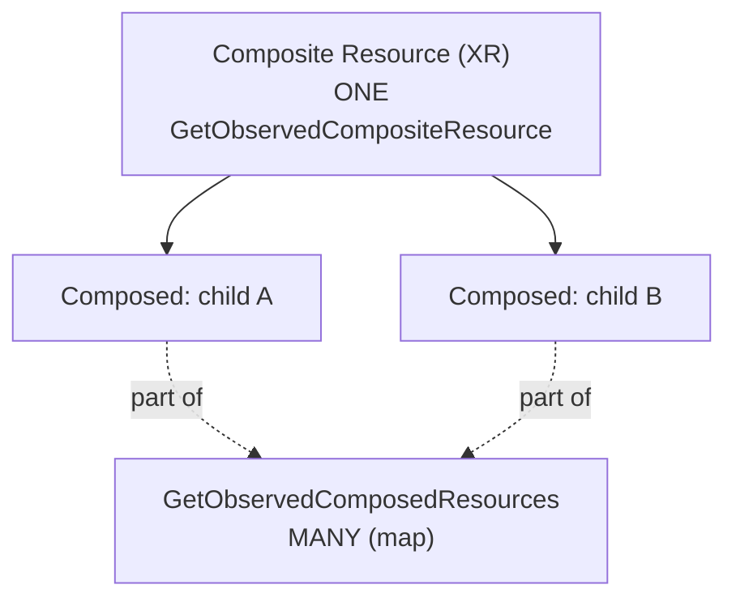

# Composite vs composed resources

```mermaid
flowchart TD
    XR["Composite Resource (XR)<br/>ONE<br/>GetObservedCompositeResource"] --> C1["Composed: child A"]
    XR --> C2["Composed: child B"]
    C1 -.->|part of| OBS["GetObservedComposedResources<br/>MANY (map)"]
    C2 -.->|part of| OBS
```
