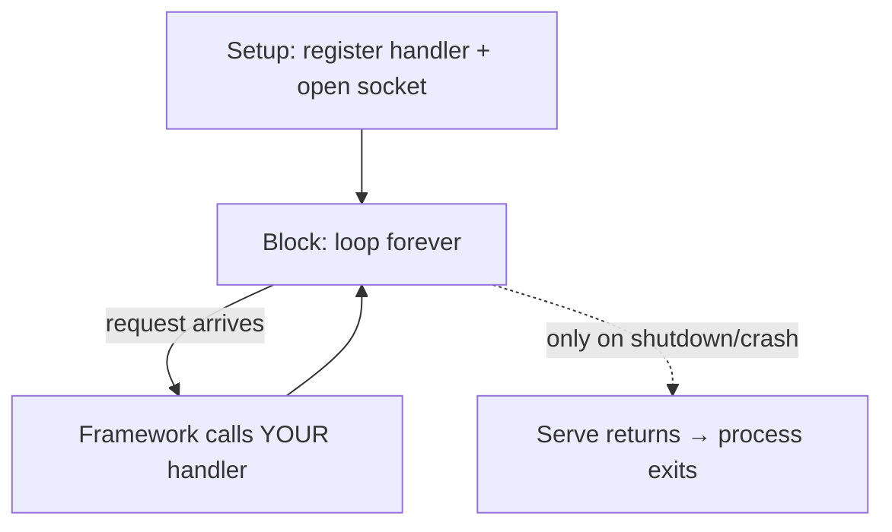
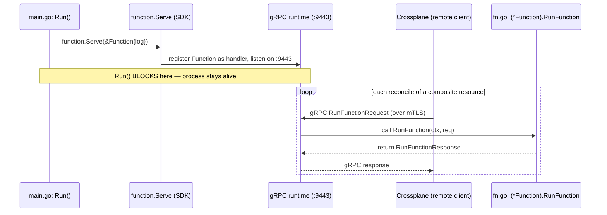

# How a Go program becomes a running server

This doc explains, from the ground up, how a Go program "registers a handler, listens on a port,
and serves requests forever." It starts with the idea as a **generic concept**, one that applies to
almost any server, then narrows the focus to how this repo implements it for Crossplane
composition functions.

If you just read [CLI.md](CLI.md), that explained how the program *starts* (parse config → call
`Run()`). This doc explains what happens *inside* `Run()` when it starts a server.

---

## Part 1 — The generic concept

> **What is a "handler"?** A handler is just the piece of *your* code; a function or an object with
> a method, that the framework calls to process one incoming request. It takes the request as input
> and produces a response. You write the handler; the framework decides *when* to call it (e.g. once per
> request). In this repo, the `Function` type has a `RunFunction` method that handles incoming requests.

### The core idea: you don't call your handler; the framework does

With ordinary code, *you* call your functions:

```go
result := doThing()   // you call it, it returns, next line runs
```

A **server** inverts this. You don't call your logic; you **hand it to a framework** and the
framework calls it later, whenever a request arrives. This is called **inversion of control** (the
"Hollywood principle": *don't call us, we'll call you*).

So a server program has two phases:

1. **Setup (you write this):** create your handler, register it, start listening.
2. **Serving (the framework runs this):** wait for requests, and for each one, call your handler.

### The three things "start a server" actually does

Almost every server, HTTP, gRPC, anything, does these three steps:

#### 1. Register a handler

**Registering** means telling the **server runtime** which object should handle requests for a
particular service: *"when a request for this service arrives, call THIS object."* It's just wiring;
nothing is called yet. (Here "server runtime" is the networking library doing the routing; the HTTP
server's mux, or the gRPC server. In gRPC you register **per service**, binding a service defined in
a `.proto` to a Go object that implements it, e.g.
`RegisterFunctionRunnerServiceServer(server, yourFunction)`.)

##### More detailed examples

**HTTP (net/http, standard library)**

Map a URL path to a handler function:
```go

package main

import (
    "fmt"
    "net/http"
)

func main() {
    mux := http.NewServeMux()

    // REGISTER: bind the path "/hello" to helloHandler.
    mux.HandleFunc("/hello", helloHandler)

    // open socket + block
    http.ListenAndServe(":8080", mux)
}

// the handler the HTTP server calls per request to /hello
func helloHandler(w http.ResponseWriter, r *http.Request) {
    fmt.Fprintln(w, "hello")
}
```
The registration line is `mux.HandleFunc("/hello", helloHandler)` → it tells the HTTP server's **mux**: "*requests for `/hello` → call `helloHandler`*"

The mux’s job is basically:

```sh
incoming HTTP request
        |
        v
   look at path
        |
        +---- /hello ----> hello handler
        |
        +---- /users ----> users handler
        |
        +---- /health ---> health handler
```

**gRPC (google.golang.org/grpc + generated code)**

Registering binds a whole service (defined in a `.proto`) to a Go object that implements it:

```go
package main

import (
    "context"
    "net"

    "google.golang.org/grpc"
    pb "example.com/greeter/proto" // generated from greeter.proto
)

// the object that implements the service
type greeterServer struct {
    pb.UnimplementedGreeterServer // embedded stub → satisfies the interface
}

// the handler method (one RPC defined in the .proto)
func (s *greeterServer) SayHello(ctx context.Context, req *pb.HelloRequest) (*pb.HelloReply, error) {
    return &pb.HelloReply{Message: "hello " + req.GetName()}, nil
}

func main() {
    lis, _ := net.Listen("tcp", ":9443") // open socket
    server := grpc.NewServer()

    // REGISTER: bind the Greeter service to our greeterServer object.
    pb.RegisterGreeterServer(server, &greeterServer{})

    server.Serve(lis) // block, serving requests
}
```

The registration line is `pb.RegisterGreeterServer(server, &greeterServer{})` → generated from the `.proto`; telling the gRPC server: "*calls for the Greeter service → route to this object,*" and gRPC then dispatches each RPC (like `SayHello`) to the matching method.

Let’s review a little here to refresh my memory:

**gRPC lets a program call a function that lives in another program over the network, as if it were local.**

**The problem gRPC solves**
Normally you call a function in your own program:

```go
result := SayHello("kara")   // both caller and function are in the SAME program
```

With gRPC, the function lives in a **different program** (maybe on another machine). You still want to "call" it like normal, but the call has to travel over the network. For that to work, both programs must agree exactly on:

- the function's name (`SayHello`),
- what you send it (a name string),
- what it sends back (a greeting string).

That written-down agreement is the `.proto` file.

**1. .proto = the contract (written in Protocol Buffers)**

A `.proto` file is a plain text file describing the messages and the service. It's language-neutral; not Go, not Python, just a description. Example:

```proto
syntax = "proto3";

// A "message" is the shape of the data (like a struct definition).
message HelloRequest {
  string name = 1;
}

message HelloResponse {
  string message = 1;
}

// A "service" is a set of callable functions (RPCs).
service Greeter {
  rpc SayHello(HelloRequest) returns (HelloResponse);
}
```

Read it as: "*There's a service called `Greeter`. It has one function, `SayHello`, which takes a `HelloRequest` and returns a `HelloResponse`*"

Think of `.proto` as a contract: it lists what's available and the exact shape of inputs/outputs. It contains no logic; just the shapes and names.

**2. "service" = a group of functions you can call remotely**

A service is just gRPC's word for a named set of remote functions (RPCs). It's very much like a Go interface: it declares what functions exist and their signatures, but not how they work.

`service Greeter { rpc SayHello(...) ... }` → "*the Greeter service offers a SayHello function*."

`~/go/pkg/mod/github.com/crossplane/function-sdk-go@v0.6.2/proto/v1/run_function.proto`:
```proto
syntax = "proto3";

package apiextensions.fn.proto.v1;

// A FunctionRunnerService is a function.
service FunctionRunnerService {
  // RunFunction runs the function.
  rpc RunFunction(RunFunctionRequest) returns (RunFunctionResponse) {}
}
```

- `service FunctionRunnerService` → the named group of remote functions.
- `rpc RunFunction(RunFunctionRequest) returns (RunFunctionResponse)` → one callable function, its input type, and its output type.


> `.proto` is a formal language with a grammar (like Go or SQL), and protoc parses it. Some tokens are reserved keywords like `syntax`, `package`, `service`, etc.

**And the messages (the "shapes" = your `fnv1` structs)**
Right below the service, the same file defines the message shapes. For example:

```proto
message RunFunctionRequest {
  RequestMeta meta = 1;        // → req.GetMeta() in your code
  State observed = 2;          // → the observed resources you read
  State desired = 3;           // → the desired resources
  optional google.protobuf.Struct input = 4;   // → your Input
  optional google.protobuf.Struct context = 5;
  // ...
}
```

**3. "generated from the `.proto`" = a tool writes the Go boilerplate for you**

The `.proto` file is just a contract; it has no Go code in it. To actually use it, you run a tool
called `protoc` (the Protocol Buffers compiler) on the file. `protoc` reads the contract and
**writes the Go code for you**, automatically. You never edit that generated file by hand; you
regenerate it whenever the `.proto` changes.

Think of it like a translator: you write the agreement once in the neutral `.proto` language, and
`protoc` translates it into Go (it can also translate the same file into Python, Java, etc.). The
generated code is pure plumbing; turning your data into bytes for the network and back; so you're
left to write only the interesting part: the actual logic.

**Every `message` becomes a Go `struct`** (with getters). Nested messages become nested structs,
  `repeated` fields become slices, and `enum` becomes a typed constant. So "all messages become
  struct types" is true.

**Each service does become a Go interface.**

A service generates more than just the interface. Alongside `GreeterServer` you also get:
- `RegisterGreeterServer(...)` → the register function,
- `UnimplementedGreeterServer` → the default-stub struct,
- `GreeterClient` → a client-side interface used by the caller to make the call.

The `rpc` methods become the **interface's methods**. The interface is the service; the individual rpc entries are the methods on it.

E.g. 

```proto
message HelloRequest { string name = 1; }
```

becaomes (generated):
```go
type HelloRequest struct {
    Name string `protobuf:"bytes,1,opt,name=name"`
}
func (x *HelloRequest) GetName() string { ... }   // getters, also generated
```

#### 2. Open a socket (listen on a port)

A **socket** is the operating system's mechanism for network communication. "Listening on port
`:9443`" means:

> "OS, reserve port 9443. Hand me any network traffic that arrives on it."

After this, a **separate process** (even on another machine) can reach your program over the
network. This is the "door" through which requests enter.

#### 3. Block (serve forever)

**Blocking** means the call *does not return*, execution stops on that line and stays there,
running an internal loop: *wait for a request → handle it → wait for the next → …* forever. It only
returns if the server crashes or is told to shut down.

This is why a server **stays alive** instead of exiting. If it didn't block, the program would fall
off the end of `main()` and the process would die before any request could arrive.

### A familiar example: an HTTP server

You've probably seen this shape. It's the same three steps:

```go
func main() {
    // 1. Register: route requests for "/hello" to helloHandler.
    http.HandleFunc("/hello", helloHandler)

    // 2 + 3. Open socket on :8080 AND block forever, serving requests.
    http.ListenAndServe(":8080", nil)
}

// The framework net/http calls this for you, once per incoming request.
func helloHandler(w http.ResponseWriter, r *http.Request) {
    fmt.Fprintln(w, "hello")
}
```

You never call `helloHandler(...)` yourself. `http.ListenAndServe` blocks, and the HTTP framework
calls `helloHandler` every time a request hits `/hello`.



**That's the whole pattern.** Everything below is just this same idea with gRPC instead of HTTP, and Crossplane as the client.

---

## Part 2 — How this repo implements it

Our composition functions are **gRPC servers** instead of HTTP servers, and the **client that sends
requests is Crossplane**. The three steps are identical; only the library (the framework) and the request type
differ.

### The two files and how they connect

The function lives in one Go package (`package main`) split across two files:

| File | Role |
| --- | --- |
| [main.go](xtenantargo/main.go) | **Setup.** Parse config, build the handler object, start the server. |
| [fn.go](xtenantargo/fn.go) | **The handler.** Defines the `Function` type and its `RunFunction` method. |

Because both files are `package main` in the same directory, they compile together as **one
program**; `main.go` can reference `Function` from `fn.go` with no import.

### Step 1 — Register (the single line that links the two files)

In [main.go](xtenantargo/main.go), inside `Run()`:

```go
return function.Serve(&Function{log: log},   // <-- the handoff
    function.Listen(c.Network, c.Address),   // network + :9443
    function.MTLSCertificates(c.TLSCertsDir),
    function.Insecure(c.Insecure),
    function.MaxRecvMessageSize(c.MaxRecvMessageSize*1024*1024))
```

- `&Function{log: log}` creates an instance of the `Function` struct **defined in fn.go** and
  injects the logger built from `--debug`.
- Handing it to `function.Serve` **registers** it as the gRPC handler. Internally the SDK does the
  gRPC equivalent of `RegisterFunctionRunnerServiceServer(server, yourFunction)`.

This one expression is the *entire* connection between `main.go` and `fn.go`. `main.go` never calls
`RunFunction` itself.

### Step 2 — Open the socket

`function.Listen(c.Network, c.Address)` tells `Serve` to listen on `tcp` `:9443` (the CLI defaults
from [CLI.md](CLI.md)). That is the same port you see as `containerPort: 9443` on the Kubernetes
Deployment. The mTLS options wire in the certificates so only Crossplane can connect.

### Step 3 — Block

`function.Serve(...)` does not return. `Run()` parks on it, the process stays alive, and the pod
keeps running; waiting for Crossplane to call.

### The handler that gets called: `RunFunction`

In [fn.go](xtenantargo/fn.go):

```go
// Function is the gRPC server object Crossplane calls.
type Function struct {
    fnv1.UnimplementedFunctionRunnerServiceServer // inherits stub methods → satisfies the gRPC interface
    log logging.Logger                            // injected dependency (the logger)
}

// RunFunction is the handler gRPC invokes on each request.
func (f *Function) RunFunction(
    _ context.Context,
    req *fnv1.RunFunctionRequest,   // input: observed state from Crossplane
) (*fnv1.RunFunctionResponse, error) { // output: desired resources
    // read req → compute desired resources → return response
}
```

- Embedding `UnimplementedFunctionRunnerServiceServer` gives `Function` default implementations of
  every method the gRPC service requires, so it satisfies the interface. You then **override only**
  `RunFunction`; the one method that matters.
- The `RunFunction` signature is fixed by the gRPC contract (exact name and types), which is how
  gRPC knows to route incoming calls to it.

### Who calls `RunFunction`? — not main.go

The caller is the **gRPC runtime**, reacting to a network request from Crossplane:



### Mapping the generic concept to this repo

| Generic step | HTTP example | This repo (Crossplane function) |
| --- | --- | --- |
| Register handler | `http.HandleFunc("/hello", h)` | `function.Serve(&Function{log})` |
| Open socket | `http.ListenAndServe(":8080", …)` | `function.Listen("tcp", ":9443")` |
| Block forever | `ListenAndServe` doesn't return | `function.Serve` doesn't return |
| Handler the framework calls | `helloHandler(w, r)` | `(*Function).RunFunction(ctx, req)` |
| Who sends requests | any HTTP client / browser | Crossplane, each reconcile |

---

## The one-paragraph summary

Starting a server means: **register** a handler object (tell the framework what to call),
**open a socket** (listen on a port so others can reach you), and **block** (loop forever handling
requests). You never call your handler yourself — the framework does, once per incoming request. In
this repo, [main.go](xtenantargo/main.go) registers the `Function` from [fn.go](xtenantargo/fn.go)
via `function.Serve`, listens on `:9443`, and blocks; then the gRPC runtime calls `RunFunction`
every time Crossplane reconciles a composite resource. The link between the two files is the single
expression `&Function{log: log}` — everything else is the framework doing the calling for you.
