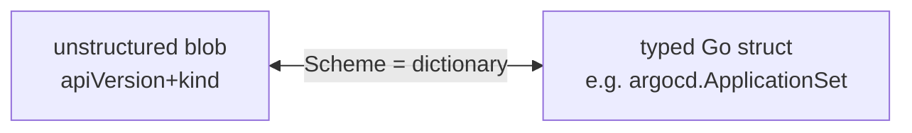

# Understanding Scheme Registration

## The one-sentence version

A **Scheme** is a two-way dictionary that maps **Go structs** ↔ **Kubernetes type identities** (a `Group/Version/Kind`). "Registering" just means adding an entry to that dictionary; for example, teaching it about `argoproj.io/v1alpha1, Kind=ApplicationSet`.

## Why the dictionary is needed

Crossplane doesn't pass your function real Go structs. It passes **untyped JSON-ish blobs** (`unstructured`; just nested `map[string]interface{}`). On the wire, a resource looks like this:

```json
{
  "apiVersion": "argoproj.io/v1alpha1",
  "kind": "ApplicationSet",
  "metadata": { "name": "my-resource" },
  "spec": { ... }
}
```

Your Go code wants to work with a **typed** struct instead (e.g. `argocd.ApplicationSet{}`); so it can write `appset.Spec.Generators[0]` with autocomplete and type-checking. Converting between those two worlds is the job of the Scheme.

## What registration actually does

A type package typically exposes an `AddToScheme` built from a line like this:

```go
s.AddKnownTypes(GroupVersion, &ApplicationSet{}, &ApplicationSetList{})
```

It tells the Scheme:

> "When you see this `apiVersion` + `kind` (`argoproj.io/v1alpha1, ApplicationSet`), the Go type to use is this struct (`*argocd.ApplicationSet`). And vice versa."

Two directions:

- **Blob → struct** (decoding observed resources): the runtime reads the `kind`, looks it up in the dictionary, finds the matching Go type, and fills it in.
- **Struct → blob** (encoding desired resources): you hand it a typed struct, it looks up the struct, finds the right `apiVersion`/`kind`, and stamps them onto the output JSON.

## What breaks without it

If you never register, the dictionary has no entry for that type. So when the runtime tries to convert, it either:

- errors with something like "no kind is registered for the type argocd.ApplicationSet", or
- produces a blob with an **empty** `apiVersion`/`kind`, which Crossplane rejects.

That's why the constructor calls `AddToScheme` **before** the function ever handles a request; it populates the dictionary up front.

## The mental model to keep



- **Scheme** = the dictionary.
- **`AddToScheme` / `AddKnownTypes`** = adding a word to the dictionary.
- **`GroupVersion` + `Kind`** = the "spelling" (the key) the dictionary looks up.

You register each external type once at startup so that every conversion during `RunFunction` can find its entry. That's the whole concept.
