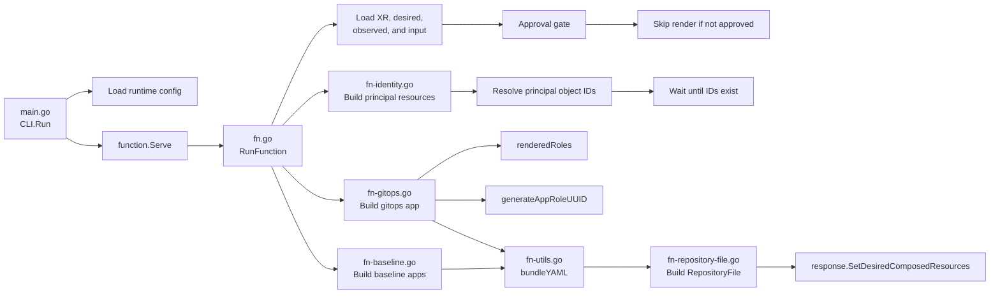

# xtenant-render Architecture

This function renders the desired tenant resources after approval. It builds Entra identity resources, waits for principal object IDs to appear in observed composed resources, renders ArgoCD Applications, bundles them into YAML, and writes that bundle through a GitHub `RepositoryFile` resource.

## Flow Diagram

## File Roles

- `main.go`: bootstraps the renderer, loads environment-based repository configuration, discovers the Crossplane namespace, and starts the gRPC server.
- `fn.go`: orchestration entry point. It loads observed and desired resources, parses the `XTenant`, handles the approval gate, coordinates identity resolution, renders ArgoCD applications, bundles YAML, and publishes the final `RepositoryFile` resource.
- `fn-identity.go`: builds Entra group or user resources for each binding and resolves principal object IDs from observed composed resources.
- `fn-gitops.go`: builds the tenant GitOps `Application`, including roles, bindings, and deterministic app-role UUIDs.
- `fn-baseline.go`: builds one baseline `Application` per unique destination cluster.
- `fn-repository-file.go`: builds the GitHub `RepositoryFile` composed resource that writes the bundled YAML to the export repository.
- `fn-utils.go`: shared helpers for YAML bundling and deterministic UUID generation.
- `fn-types.go`: renderer-local types and shared metadata label helper.
- `input/v1beta1/input.go`: defines the function input schema, including GitHub config, Azure principal settings, and tenant bindings.

## Who Calls Whom

1. `main.go` reads runtime configuration from environment variables and creates `Function`.
2. Crossplane calls `Function.RunFunction` in `fn.go`.
3. `RunFunction` reads the observed XR, desired composed resources, and observed composed resources.
4. `RunFunction` converts the XR into `XTenant` and parses the function input.
5. `RunFunction` derives unique destination clusters from tenant bindings using `uniqueClustersFromBindings`.
6. If the tenant is not approved, `RunFunction` exits early without rendering resources.
7. For each binding, `RunFunction` calls `buildPrincipalResources` to add Entra identity resources to the desired map.
8. `RunFunction` calls `resolveBindingPrincipalObjectID` to read principal IDs from observed resources. If any are not ready, it returns with `Rendered=False` and waits for the next reconcile.
9. Once all principal IDs are ready, `RunFunction` calls `buildBaselineApplications` and `buildGitopsApplication` to render ArgoCD Applications.
10. `buildGitopsApplication` calls `renderedRoles`, `policiesForRole`, and `generateAppRoleUUID` to produce tenant role configuration.
11. `RunFunction` calls `bundleYAML` to serialize the rendered applications into a single YAML bundle.
12. `RunFunction` calls `buildRepositoryFile` to create the GitHub export resource, then writes the full desired set back through `response.SetDesiredComposedResources`.

## Key Design Boundaries

- `fn.go` owns orchestration and Crossplane request/response handling.
- `fn-identity.go` owns external identity resource generation and object ID resolution.
- `fn-gitops.go` and `fn-baseline.go` own ArgoCD application rendering.
- `fn-repository-file.go` owns export-to-GitHub packaging.
- `fn-utils.go` and `fn-types.go` provide shared helpers and renderer-local types.
